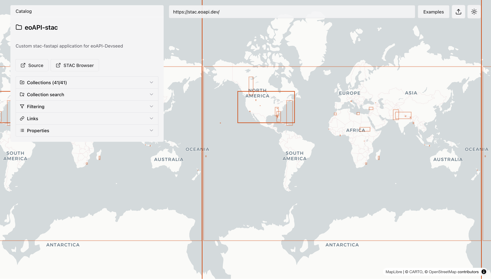

# stac-map

[](https://github.com/developmentseed/stac-map/actions/workflows/ci.yaml)
[](https://github.com/developmentseed/stac-map/deployments/github-pages)
[](https://github.com/developmentseed/stac-map/releases)

The map-first, single-page, statically-hosted STAC visualizer at <https://developmentseed.org/stac-map>.

<!-- markdownlint-disable MD033 -->
<picture>
  <source media="(prefers-color-scheme: dark)" srcset="img/stac-map-dark.png">
  
</picture>
<!-- markdownlint-enable MD033 -->

Includes:

- Natural language collection search
- **stac-geoparquet** visualization, upload, and download

> [!WARNING]
> This application is in its infancy :baby: and will change significantly and/or break at any time.

## Development

Get [yarn](https://yarnpkg.com/), then:

```shell
git clone git@github.com:developmentseed/stac-map
cd stac-map
yarn install
yarn dev
```

This will open a development server at <http://localhost:5173/stac-map/>.

We have some code quality checks/tools:

```shell
yarn lint
yarn format
```

And some simple tests:

```shell
yarn playwright install
yarn test
```

## Contributing

We have some [architecture documentation](./docs/architecture.md) to help you get the lay of the land.
We use Github [Pull Requests](https://github.com/developmentseed/stac-map/pulls) to propose changes, and [Issues](https://github.com/developmentseed/stac-map/issues) to report bugs and request features.

We use [semantic-release](https://github.com/semantic-release/semantic-release?tab=readme-ov-file) to create [releases](https://github.com/developmentseed/stac-map/releases).
This requires our commit messages to conform to [Conventional Commits](https://www.conventionalcommits.org/en/v1.0.0/).

## Deploying

See [deploy.yaml](./.github/workflows/deploy.yaml) for a (drop-dead simple) example of deploying this application as a static site via Github Pages.

## Versioning

For now, we use a form of [Sentimental Versioning](https://github.com/dominictarr/sentimental-versioning#readme), where we use MAJOR, MINOR, and PATCH versions to communicate the "weight" of changes.
We may formalize our releases into a stricter form of [Semantic Versioning](https://semver.org/) at some point in the future.
