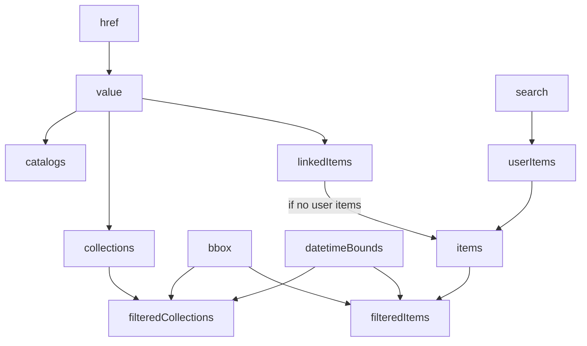

# Architecture

What follows is some light documentation on how **stac-map** is built.

## Core concepts

Here's the two core concepts of **stac-map**.

### Everything starts with the `href`

**stac-map** is driven by one (and only one) `href` value, which is a URI to a remote file _or_ the name of an uploaded file.
The `href` is stored in the app state and is synchronized with a URL parameter, which allows the sharing of links to **stac-map** pointed at a specific STAC value.

### The value could be (almost) anything

Once the `href` is set, the data at the `href` is loaded into the app as a single `value`.
The `value` could be:

- A STAC [Catalog](https://github.com/radiantearth/stac-spec/blob/master/catalog-spec/catalog-spec.md), [Collection](https://github.com/radiantearth/stac-spec/blob/master/collection-spec/collection-spec.md), or [Item](https://github.com/radiantearth/stac-spec/blob/master/item-spec/item-spec.md)
- A STAC [API](https://github.com/radiantearth/stac-api-spec)
- A GeoJSON [FeatureCollection](https://datatracker.ietf.org/doc/html/rfc7946#section-3.3) with STAC Items as its `features` (commonly referred to as an `ItemCollection`, though no such term exists in the STAC specification)
- A [stac-geoparquet](https://github.com/stac-utils/stac-geoparquet) file, which is treated as an `ItemCollection`.

The behaviors of the app are then driven by the attributes of the `value`.

## Concept diagram

Any values that don't have a parent are set by the user, either directly (e.g. `href`) or by interacting with the app (e.g. `bbox`).

